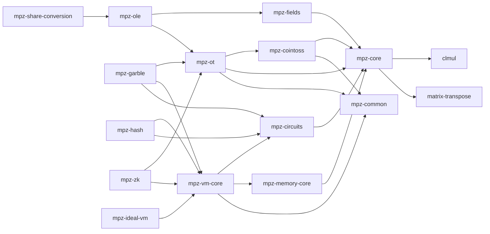

    

# mpz

mpz is a collection of multi-party computation libraries written in Rust 🦀.

The scope of this project is currently limited to being used to implement [TLSNotary](https://github.com/tlsnotary/tlsn). It is not intended for general public use.

See [our design doc](./DESIGN.md) for information on design choices, standards and project structure.

## ⚠️ Notice

This project is currently under active development and should not be used in production. Expect bugs and regular major breaking changes. Use at your own risk.

## Crates

Many protocol crates follow a `-core` / high-level split: the `-core` crate contains
the cryptographic internals without any I/O, while the parent crate adds async
networking on top. See [Core vs IO](./DESIGN.md#core-vs-io) for rationale.

### Primitives

- [`clmul`](./crates/clmul/) - Carry-less multiplication.
- [`matrix-transpose`](./crates/matrix-transpose/) - Bit-wise matrix transposition.

### Foundation

- [`mpz-core`](./crates/core/) - Core cryptographic primitives (AES, PRG, GGM tree, LPN, commitment).
- [`mpz-common`](./crates/common/) - Protocol execution runtime, I/O, multiplexing, and threading. No cryptography.
- [`mpz-fields`](./crates/fields/) - Finite-field arithmetic.

### Circuits

- [`mpz-circuits`](./crates/circuits/) ([`-core`](./crates/circuits-core/), [`-data`](./crates/circuits-data/)) - Boolean circuit DSL, builder, and pre-compiled circuits (AES, SHA-2, etc.).

### Protocols

- [`mpz-cointoss`](./crates/cointoss/) ([`-core`](./crates/cointoss-core/)) - 2-party coin-toss protocol.
- [`mpz-ot`](./crates/ot/) ([`-core`](./crates/ot-core/)) - Oblivious transfer (Chou-Orlandi, KOS, Ferret).
- [`mpz-ole`](./crates/ole/) ([`-core`](./crates/ole-core/)) - Oblivious linear evaluation.
- [`mpz-share-conversion`](./crates/share-conversion/) ([`-core`](./crates/share-conversion-core/)) - Multiplicative-to-additive and additive-to-multiplicative share conversion.

### Virtual Machine

- [`mpz-memory-core`](./crates/memory-core/) - Memory abstraction for the MPC virtual machine.
- [`mpz-vm-core`](./crates/vm-core/) - VM traits and interfaces (`Vm`, `Execute`).
- [`mpz-ideal-vm`](./crates/ideal-vm/) - Ideal (plaintext) VM for testing.

### Higher-level Protocols

- [`mpz-garble`](./crates/garble/) ([`-core`](./crates/garble-core/)) - Half-gate garbled circuit protocols.
- [`mpz-zk`](./crates/zk/) ([`-core`](./crates/zk-core/)) - QuickSilver zero-knowledge proofs.
- [`mpz-hash`](./crates/hash/) - MPC-friendly hash functions (SHA-2, Blake3, Keccak) built on the circuit and VM layers.

### Dependency Graph

The `-core` suffix is omitted for brevity; see the crate list above for the
full split. Arrows point from dependent to dependency.

## License
All crates in this repository are licensed under either of

- [Apache License, Version 2.0](http://www.apache.org/licenses/LICENSE-2.0)
- [MIT license](http://opensource.org/licenses/MIT)

at your option.

## Contribution

Unless you explicitly state otherwise, any contribution intentionally submitted
for inclusion in the work by you, as defined in the Apache-2.0 license, shall be
dual licensed as above, without any additional terms or conditions.

See [CONTRIBUTING.md](CONTRIBUTING.md).

## Contributors

- [TLSNotary](https://github.com/tlsnotary)
- [Primus (formerly "PADO")](https://github.com/primus-labs)

### Pronunciation

mpz is pronounced "em-peasy".
